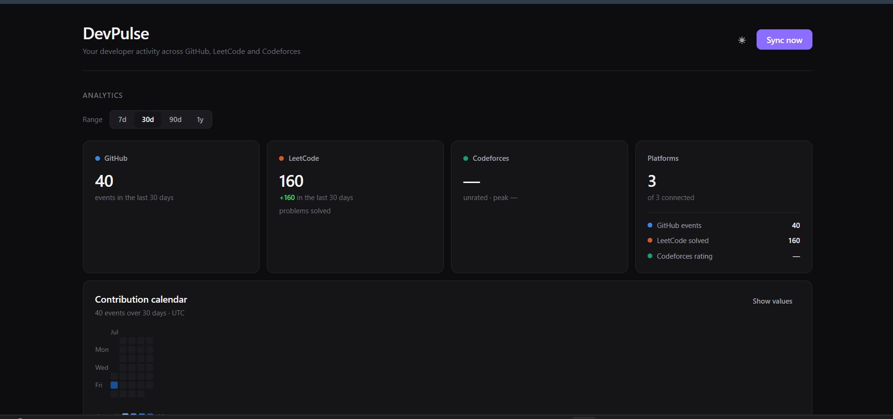
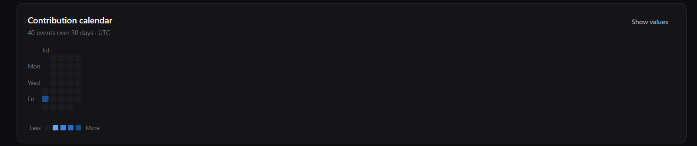
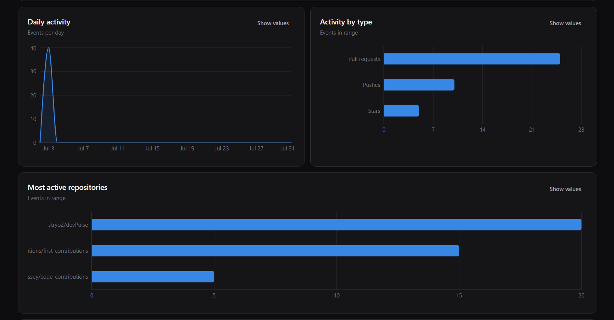
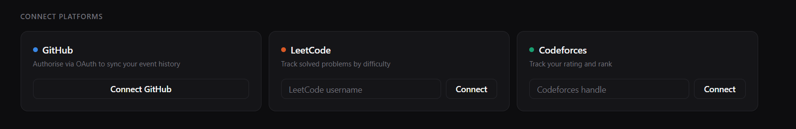
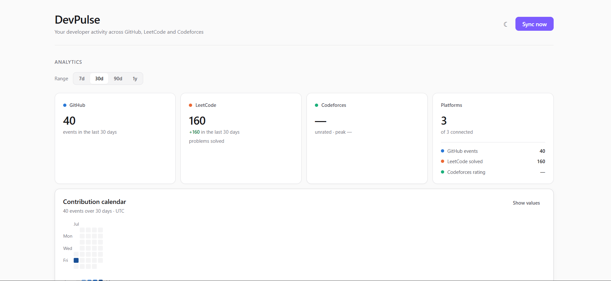

<div align="center">

# DevPulse

**Your developer activity across GitHub, LeetCode and Codeforces — in one dashboard.**

Your work as a developer is scattered. Commits live on GitHub, problem-solving lives on LeetCode,
competitive results live on Codeforces. DevPulse pulls all three into a single account, keeps a
historical record, and turns it into analytics you can actually read.

[**Live demo**](https://dev-pulse-lake.vercel.app) · [Architecture](docs/ARCHITECTURE.md) · [API](docs/API.md) · [Deployment](docs/DEPLOYMENT.md)

[](https://nodejs.org)
[](https://react.dev)
[](https://vite.dev)
[](https://expressjs.com)
[](https://postgresql.org)
[](https://prisma.io)
[](https://redis.io)
[](https://docs.bullmq.io)
[](LICENSE)

</div>

---

## Features

**🔗 Three-platform integration** — GitHub via OAuth, LeetCode via its public GraphQL API, and
Codeforces via `user.info`. Each platform is fetched by a dedicated adapter and passed through a
normalizer before it touches the database.

**🔐 GitHub OAuth + JWT auth** — Email/password accounts secured with bcrypt. GitHub access tokens
are encrypted at rest with AES-256-CBC, and the OAuth `state` parameter is itself a signed JWT — it
identifies the user across the public callback *and* serves as the CSRF check.

**📊 Analytics dashboard** — A trailing-window summary over 7, 30, 90 or 365 days: event totals,
activity by type, a GitHub-style contribution calendar, per-repository breakdowns, LeetCode solve
counts by difficulty, and Codeforces rating movement.

**🕓 Historical activity tracking** — Every sync writes immutable rows keyed by
`(userId, platform, sourceKey)`, so repeated syncs are idempotent and the record grows into a real
timeline.

**⚙️ Background sync with BullMQ + Redis** — Syncs never block a request. The API enqueues a job and
returns; a worker does the fetching, with exponential backoff and three attempts.

**⏰ Scheduled synchronization** — A cron tick fans out into one sync job per connected user.
Deduplication keys guarantee a slow sync can never overlap its own next run.

**📈 Charts and visualizations** — Recharts plus a hand-rolled SVG contribution heatmap. Every chart
has a toggleable table view, because a tooltip should never be the only way to read a value.

**📱 Responsive UI with light + dark modes** — A token-driven design system that adapts to
`prefers-color-scheme` and respects `prefers-reduced-motion`.

---

## Screenshots

|  |  |
| --- | --- |
|  |  |
| **Dashboard overview** — KPI tiles for each connected platform with the range filter applied. | **Contribution calendar** — GitHub events per day, bucketed against the window's own maximum. |
|  |  |
| **Activity charts** — Daily trend, activity by type, and most-active repositories. | **Connect platforms** — OAuth for GitHub, username handoff for LeetCode and Codeforces. |

|  |
| --- |
| **Light mode** — The full token set inverts; chart colours are a selected light ramp, not an inversion of the dark one. |

---

## Tech Stack

| Layer | Technologies |
|---|---|
| **Frontend** | React 19 · Vite 8 · React Router 7 · Recharts 3 · Axios · plain CSS design system |
| **Backend** | Node.js (ESM) · Express 5 · Prisma 6 · Zod 4 · Axios |
| **Database** | PostgreSQL — 16 locally via Docker, 18.4 on Neon in production · Prisma Migrate |
| **Jobs** | BullMQ 5 · Redis (ioredis) |
| **Auth** | jsonwebtoken · bcrypt · Node `crypto` (AES-256-CBC) · GitHub OAuth |
| **Infra** | Docker Compose (local) · Vercel · Render · Neon · Upstash · GitHub Actions |
| **Tooling** | ESLint 10 · nodemon |

---

## Architecture

DevPulse separates **reading** from **fetching**. An HTTP request never waits on a third-party API:
the API enqueues work and returns immediately, a worker performs the fetch, and the dashboard reads
whatever has landed in the database.

```
User → OAuth → API → Queue → Worker → Database → Analytics → Dashboard
```

The one design decision worth knowing up front:

| Platform | What a row means | Valid for |
|---|---|---|
| **GitHub** | one discrete event | time series, per-day charts, calendars |
| **LeetCode** | a cumulative counter changed | totals, windowed deltas, growth |
| **Codeforces** | profile state changed | current state, rating movement |

GitHub is **event-based**; LeetCode and Codeforces are **snapshot-based**. That is not an incomplete
integration — those APIs expose cumulative state, not history, and the analytics engine reports each
platform under the model it actually uses.

📖 **[Full architecture](docs/ARCHITECTURE.md)** — diagrams, project structure, the analytics engine,
background jobs and the security model.

---

## Running locally

### Prerequisites

- **Node.js 22** (`>=22 <23`, enforced by `engines`)
- **Docker** — or your own PostgreSQL 14+ and Redis 6+
- A **GitHub OAuth App** ([create one](https://github.com/settings/developers)) with the callback
  URL set to `http://localhost:3000/api/platforms/github/callback`

### 1. Clone and configure

```bash
git clone https://github.com/stryo2/devPulse.git
cd devPulse

cp backend/.env.example backend/.env   # then fill in the six required values
```

Every variable is documented in
[docs/DEPLOYMENT.md § Environment variables](docs/DEPLOYMENT.md#environment-variables).

### 2. Start the stack

```bash
docker compose up --build                            # postgres, redis, api, worker
docker compose exec api npx prisma migrate deploy    # first run only
```

Host ports: API `3000`, Postgres `5433`, Redis `6380`.

### 3. Start the frontend

```bash
cd frontend && npm install && npm run dev            # http://localhost:5173
```

<details>
<summary><b>Without Docker</b></summary>

Run PostgreSQL and Redis yourself, then in separate terminals:

```bash
cd backend && npm install
npx prisma migrate deploy
npm run dev              # API   — http://localhost:3000
npm run worker:dev       # worker — required, or nothing ever syncs
```

</details>

---

## Testing

There is **no automated test suite yet** — it is the most significant gap in the project and is
tracked below.

What is enforced today, on every pull request via GitHub Actions:

```bash
cd frontend && npm run lint && npm run build    # ESLint + production build
cd backend  && npx prisma validate              # schema validity
```

Manual verification is scripted as a checklist in
[docs/DEPLOYMENT.md § Pre-deploy smoke test](docs/DEPLOYMENT.md#pre-deploy-smoke-test), covering
boot validation, health probes, auth, CORS, and the queue end to end.

---

## Deployment

DevPulse runs in production on a fully free-tier stack:

| Component | Host |
|---|---|
| Frontend | [Vercel](https://dev-pulse-lake.vercel.app) |
| API + worker | [Render](https://devpulse-api-ly4m.onrender.com) |
| PostgreSQL | Neon |
| Redis | Upstash |
| CI + scheduling | GitHub Actions |

Render's free tier has no background-worker service and no cron, so the BullMQ worker runs inside
the API process and a scheduled workflow drives the periodic fan-out.

📖 **[Deployment guide](docs/DEPLOYMENT.md)** — environment matrix, runbook, rollback procedures,
monitoring and free-tier limits.

---

## Project status

**Working end to end in production.** Three platforms sync on a schedule, analytics aggregate in
SQL, and the dashboard renders live data.

Completed:

- [x] Three-platform integration with adapters and normalizers
- [x] GitHub OAuth with encrypted token storage
- [x] Analytics engine with event/snapshot models
- [x] Background sync via BullMQ with scheduled fan-out
- [x] Analytics dashboard with light and dark modes
- [x] Dockerized local development
- [x] Production deployment with environment-driven config
- [x] CI pipeline — lint, build and schema checks on every pull request

Planned:

- [ ] **Automated tests** — unit coverage for the analytics pure functions and adapter normalizers
- [ ] **Insight-driven analytics** — streaks, consistency, best coding day/time, period-over-period
      comparison. Would have to be GitHub-only and computed over all history to be meaningful
- [ ] **Growth curves from snapshot history** — historical rows are currently discarded in favour of
      the latest value; those rows *are* the growth curve
- [ ] **`lastSyncedAt` on `ConnectedPlatform`** — without it, a worker outage is indistinguishable
      from user inactivity
- [ ] **Job status endpoint** — the dashboard currently polls on a fixed delay after a sync
- [ ] **Activity retention** — snapshots grow unbounded against a 0.5 GB free-tier cap
- [ ] **Structured logging** — replace `console.*` with a real logger and request ids
- [ ] **Token refresh and disconnect** — revoke or re-authorize a platform from the UI
- [ ] **Additional platforms** — GitLab, HackerRank, Stack Overflow

---

## Contributing

1. Fork and branch: `git checkout -b feat/your-feature`
2. Keep to the existing structure — adapters stay platform-shaped, normalizers stay database-shaped
3. Run `npm run lint` and `npm run build` in `frontend/`
4. Commit using [Conventional Commits](https://www.conventionalcommits.org/)
5. Open a pull request. CI must pass before it can be merged

**Two conventions worth knowing:**

- **The event/snapshot distinction is intentional.** Before proposing that LeetCode or Codeforces
  adopt submission-history APIs, read the [integration model](docs/ARCHITECTURE.md#the-integration-model).
- **The chart palette is validated.** The `--viz-*` tokens in
  [`frontend/src/styles/dashboard.css`](frontend/src/styles/dashboard.css) were checked for contrast
  and colour-vision separation against both light and dark surfaces. Re-run that validation before
  changing them.

---

## License

Released under the [MIT License](LICENSE).

---

<div align="center">

**Built by [stryo2](https://github.com/stryo2)**

If DevPulse is useful to you, a ⭐ is appreciated.

</div>
