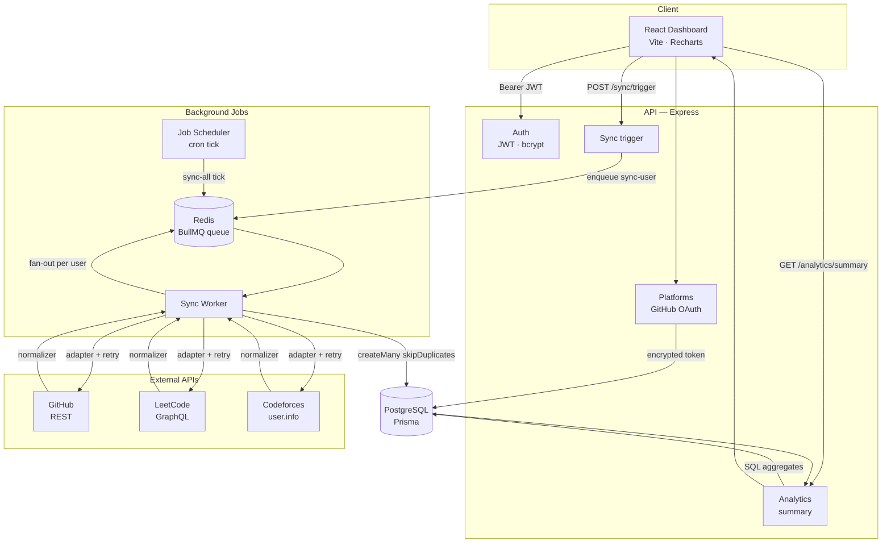
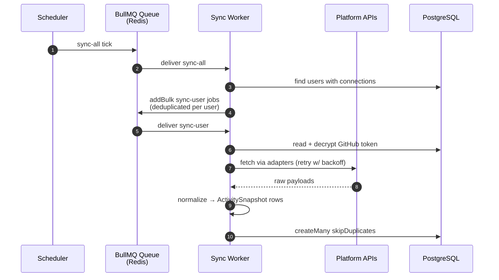

# DevPulse — Architecture

DevPulse separates **reading** from **fetching**. An HTTP request never waits on a third-party API:
the API enqueues work and returns immediately, a worker performs the fetch, and the dashboard reads
whatever has landed in the database.

```
User → OAuth → API → Queue → Worker → Database → Analytics → Dashboard
```



In production the worker runs **inside** the API process rather than as a separate service; see
[DEPLOYMENT.md](DEPLOYMENT.md) for why.

---

## The integration model

This is the single most important design decision in the project, and it is deliberate:

| Platform | What a row means | `timestamp` is | Valid for |
|---|---|---|---|
| **GitHub** | one discrete event | real upstream event time | time series, per-day charts, calendars |
| **LeetCode** | a cumulative counter changed | detection time | totals, windowed deltas, growth |
| **Codeforces** | profile state changed | detection time | current state, rating movement |

GitHub is **event-based**; LeetCode and Codeforces are **snapshot-based**. This is not an incomplete
integration — those APIs expose cumulative state, not history. The analytics engine reports each
platform under the model it actually uses rather than pretending all three are alike.

---

## Project structure

```
DevPulse/
├── backend/
│   ├── prisma/
│   │   ├── migrations/          # Applied migrations
│   │   └── schema.prisma        # User, ConnectedPlatform, ActivitySnapshot
│   └── src/
│       ├── adapters/            # One per platform — raw API access + retry
│       ├── normalizers/         # Platform payload → ActivitySnapshot rows
│       ├── controllers/         # HTTP handlers
│       ├── services/            # analytics, sync, auth, platform logic
│       ├── queues/              # BullMQ queue + cron job scheduler
│       ├── workers/             # Sync processor + standalone worker entry
│       ├── middleware/          # JWT auth, cron auth, error handling
│       ├── validators/          # Zod request schemas
│       ├── config/              # Validated environment configuration
│       ├── utils/               # crypto, retry, shared axios client
│       ├── lib/                 # Prisma and Redis singletons
│       └── index.js             # Express entry point
│
├── frontend/
│   └── src/
│       ├── api/                 # Axios instance + endpoint wrappers
│       ├── components/
│       │   └── analytics/       # Panels, stat tiles, chart cards
│       │       └── charts/      # Recharts wrappers + shared chart chrome
│       ├── hooks/               # useAnalytics — request-key based loading
│       ├── lib/                 # Session handling, LeetCode helpers
│       ├── pages/               # Login, Register, Dashboard
│       ├── styles/              # Dashboard styles + validated chart palette
│       └── index.css            # Design tokens
│
└── docs/                        # Architecture, API and deployment docs
```

**Where the layers split:** adapters know how an API is shaped, normalizers know how the database is
shaped, and nothing else needs to know either. Adding a fourth platform means one adapter, one
normalizer, and a branch in the sync service.

---

## Analytics engine

One rule governs everything: **`null` means exactly one thing — the user has not connected that
platform.** A connected platform always returns a block, zeroed if it has never been synced, flagged
with `asOf: null`. "Absent" and "zero" are different facts, and the UI must be able to tell them
apart.

### How each platform is computed

**GitHub — event-based.** All counting happens in SQL (`groupBy` plus two raw aggregate queries), so
no rows are transferred merely to be counted and results stay exact at any volume. The daily series
is zero-filled against a generated date spine, so every day in the requested range is present and
charts need no gap handling. The window is snapped to a UTC day boundary — without that, `days=30`
produces 31 buckets.

**LeetCode and Codeforces — snapshot-based.** These APIs expose cumulative state with no history, so
"solved in the last N days" can only be a difference between two observations:

```
solvedInWindow = current − (count as of windowStart)
```

`DISTINCT ON` selects the latest row per difficulty, plus a second query for the last row *before*
the window start as a baseline.

### `partialWindow` — an honesty flag

If no snapshot exists from before the window began, the baseline falls back to zero and the delta
equals the running total. That is not a bug — the measurement history is simply younger than the
requested range. The engine sets `partialWindow: true` to say so explicitly.

The practical consequence: a freshly connected account reports the same figure for 7, 30, 90 and 365
days. Ranges begin reporting genuine deltas as history accumulates behind them.

Codeforces degrades differently on purpose: `ratingChangeInWindow` returns `null` rather than
`rating − 0`, because a rating is not cumulative from zero.

### Deliberate limits

- **Repositories cap at 100** per window, sorted by count descending, with `reposTruncated: true`
  when exceeded. Never a silent undercount, and the frontend picks its own top N.
- **Streaks and time-of-day are not implemented.** A cross-platform streak would measure how often
  the *worker* ran, not how often you worked — it would change whenever `SYNC_SCHEDULE_CRON` is
  edited. A valid implementation would have to be GitHub-only and computed over all history rather
  than the selected window, so that moving the range filter cannot change a streak.

---

## Background jobs



### The queue

A single queue, `devpulse-sync`, carries two job types:

| Job | Payload | Behaviour |
|---|---|---|
| `sync-all` | none | The scheduled tick. Fans out into one `sync-user` job per connected user. |
| `sync-user` | `{ userId }` | Fetches, normalizes and persists that user's platforms. |

Defaults: **3 attempts** with exponential backoff from 1s, completed jobs retained 24h (max 1000),
failed jobs retained 7 days (max 5000). Worker concurrency is configurable via
`SYNC_WORKER_CONCURRENCY`. An unrecognised job name is logged and returned rather than thrown — a
routing mistake cannot be fixed by retrying it.

### Preventing duplicate work

Two mechanisms, addressing different problems:

1. **Scheduler idempotency.** The cron entry uses a fixed id, `devpulse-sync-all`, upserted at worker
   boot. Restarts, redeploys and additional worker replicas all converge on that one entry instead of
   stacking duplicate schedules.

2. **Per-user deduplication.** Each fan-out job carries the key `sync-user:{userId}` with
   `keepLastIfActive`, capping a user at one active plus one waiting job. A sync that runs longer
   than the schedule interval can never overlap its own next run.

Disabling the schedule (`SYNC_SCHEDULE_ENABLED=false`) actively **removes** the scheduler from Redis
rather than skipping registration — otherwise flipping the flag off would leave a live scheduler
running and appear to do nothing.

### Scheduling in production

Render's free tier sleeps after ~15 minutes idle, and a BullMQ scheduler only fires while a process
is alive. Production therefore sets `SYNC_SCHEDULE_ENABLED=false` and drives the fan-out from a
GitHub Actions cron calling `POST /api/sync/run-all`. See [DEPLOYMENT.md](DEPLOYMENT.md).

### Idempotent writes

Rows are inserted with `createMany({ skipDuplicates: true })` against the unique constraint
`(userId, platform, sourceKey)`. Re-syncing the same window is therefore free of duplicates, which
is what makes a frequent schedule safe.

---

## Security model

- Passwords hashed with bcrypt (cost 10); login and register return an identical error so accounts
  cannot be enumerated.
- Sessions are stateless JWTs sent as `Authorization: Bearer`, not cookies — so CORS is an
  allowlist, not a credential boundary.
- GitHub access tokens are encrypted at rest with AES-256-CBC using a fresh IV per token.
- The OAuth `state` parameter is itself a short-lived signed JWT: it carries the user id across the
  public callback *and* acts as the CSRF check.
- `ENCRYPTION_KEY` cannot be rotated without invalidating every stored platform token.
